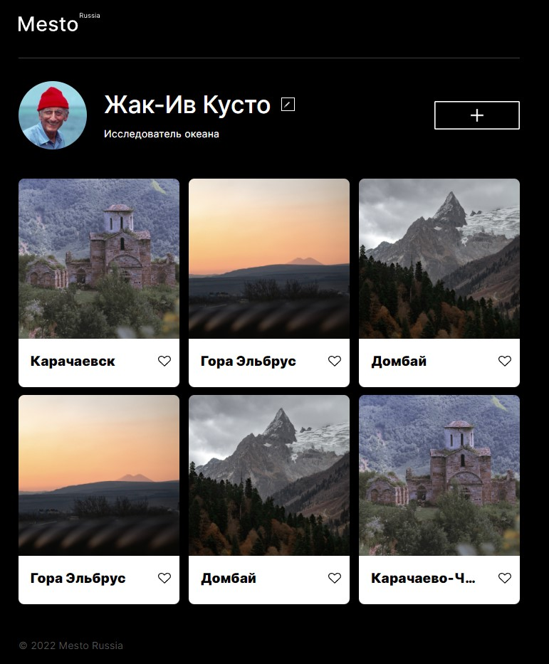
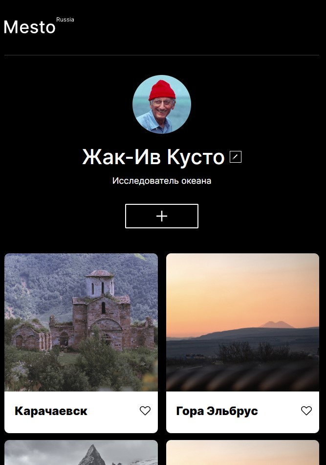
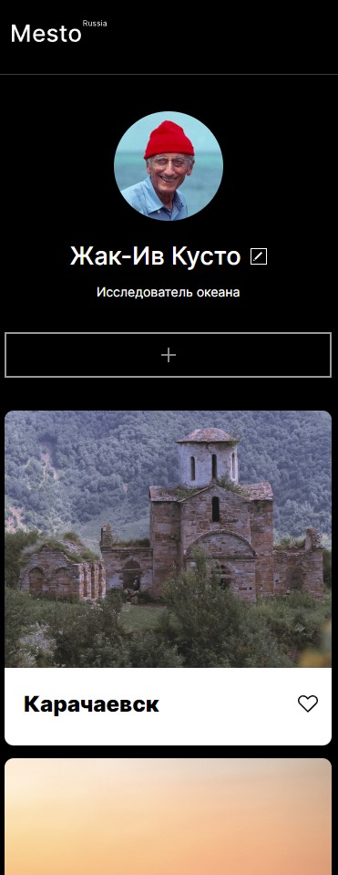

# Проект: Место

### Обзор

- Интро
- Figma
- Картинки

**Интро**
Сервис Mesto: интерактивная страница, куда можно добавлять фотографии, удалять их и ставить лайки.
В проекте использовалось: БЭМ-методология, Flexbox, Grid, Адаптивная вёрстка, JavaScript.

- [Ссылка на проект](https://maxim-perepletchikov.github.io/mesto/)

**Figma**

- [Ссылка на макет в Figma](https://www.figma.com/file/2cn9N9jSkmxD84oJik7xL7/JavaScript.-Sprint-4?node-id=0%3A1)

**Картинки**

  
  
  

